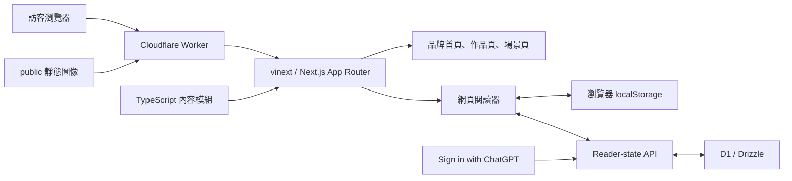

# 允生作品｜技術架構說明書

## 1. 文件目的

本文件說明「允生作品」網站目前的技術架構、內容邊界、執行流程與擴充接點，供後續開發、審查與維運使用。

本站目前是以《燦燦烈日下》為第一部作品的公開品牌與閱讀網站，已提供讀者帳號、跨裝置閱讀狀態與購買記錄唯讀查詢。它仍不是完整的出版電商平台：內容後台、支付、訂單建立與完整電子書解鎖尚未建立。

產品術語與長期邊界以根目錄的 [`CONTEXT.md`](../CONTEXT.md) 為準。

## 2. 架構摘要

本站採用 Next.js App Router 的頁面模型，由 vinext 編譯成可在 Cloudflare Worker 執行的產物。公開作品資料存放在 TypeScript 內容 registry；伺服器元件只把允許公開的作品、場景與試讀內容送到瀏覽器。訪客的閱讀偏好與進度保存在 `localStorage`；登入後透過身份 adapter 與 D1 reader-state seam 合併並跨裝置同步。



## 3. 技術組成

| 層級 | 技術 | 現行用途 |
| --- | --- | --- |
| UI 與路由 | Next.js 16、React 19、TypeScript | App Router 頁面、伺服器元件、閱讀器互動 |
| 樣式 | Tailwind CSS 4 PostCSS 工具鏈、全域 CSS | 品牌、作品、場景與閱讀器的視覺呈現 |
| 建置 | vinext、Vite | 把 Next.js 應用編譯成 Cloudflare Worker 產物 |
| 執行環境 | Cloudflare Worker | 回應頁面請求並提供靜態資產與圖像最佳化入口 |
| 內容來源 | TypeScript 內容模組 | 作品目錄、公開章節、場景節選與內容版本 |
| 用戶端狀態 | React state、`localStorage` | 訪客字體大小、日夜模式與裝置閱讀進度；登入後仍作非破壞後備 |
| 資料層 | Drizzle ORM、Cloudflare D1 | 讀者帳號、每部作品閱讀狀態、購買記錄與購買權益 |
| 驗證 | Node.js test runner、ESLint、正式建置 | 從 Worker 回應驗證公開頁面與內容安全邊界 |

執行環境要求 Node.js `>=22.13.0`，套件管理器以 `npm` 與已提交的 `package-lock.json` 為準。

## 4. 主要模組與責任

### 4.1 路由與頁面

- `/`：品牌首頁（Brand home），介紹「允生作品」並導向各作品。
- `/works/cancan-lierixia`：《燦燦烈日下》作品展示頁（Work page），包含故事、人物、概念選角、場景與章節目錄。
- `/works/cancan-lierixia/scenes/[sceneSlug]`：公開場景節選詳情；建置時依場景內容產生穩定路徑。
- `/read/[workSlug]/[chapterSlug]`：網頁閱讀器或未開放章節提示頁。

根佈局統一管理繁體中文語系、網站 metadata、Open Graph 與 favicon。各作品及動態內容頁再提供自己的標題與摘要。

### 4.2 作品內容模型

內容層分成兩個公開查詢方向：

- 作品目錄查詢只回傳作品資料、章節順序、內容版本與公開狀態。
- 閱讀內容查詢只在章節狀態為「公開閱讀」或「免費試讀」時回傳正文段落。

每部作品以穩定 `slug` 作為網址與內容查詢識別；章節也有自己的穩定 `slug`、順序、內容版本與可讀狀態。免費試讀章數被限制為 1～3 章，目前《燦燦烈日下》開放第一章。

場景內容與作品目錄分開管理。每個場景包含穩定 `slug`、圖像、替代文字、參與人物、節選段落與「完稿／草稿」標記，頁面必須向讀者揭露內容狀態。

### 4.3 公開內容安全邊界

未開放章節的正文不得出現在伺服器回應中。頁面不是用 CSS 或用戶端條件把全文藏起來，而是由伺服器端內容查詢直接省略段落，再回傳「尚未開放」介面。

這是目前最重要的內容授權邊界：完整手稿與未核准公開的章節不能被打包進瀏覽器可讀的 HTML。新增作品或調整試讀範圍時，必須持續以渲染後 HTML 測試此行為。

### 4.4 網頁閱讀器

閱讀器頁面由伺服器元件取得核准公開的內容，再交給用戶端元件提供互動。現有功能包括：

- 小、標準、大三種字體大小；
- 日間與夜間模式；
- 依捲動位置估算的閱讀進度；
- 以段落錨點優先恢復上次閱讀位置；
- 當錨點不存在時，以百分比位置作為後備恢復方式。

狀態以版本化 JSON 儲存在 `yunsheng-reader:<workSlug>`。資料損壞或格式不符合目前版本時會被忽略。登入後本機與雲端狀態以 `updatedAt` 合併，較新者勝出、同時間以伺服器為準；同步失敗不會清除本機狀態或阻止閱讀。

### 4.5 靜態資產與圖像

作品封面、場景插畫、品牌視覺與 favicon 放在 `public/`，由 Worker 的資產綁定提供。Worker 也保留 vinext 圖像最佳化入口；目前主要內容頁多使用原始 `` 路徑，避免額外圖片載入器相依。

### 4.6 身份與資料庫

身份 adapter 解析 Sites 轉送的 ChatGPT 已驗證 email 與可選顯示名稱，首次登入時自動建立最小化讀者帳號。公開作品與試讀不需登入；`/account`、`/api/reader-state` 與 `/api/purchases` 才使用身份。

D1 schema 包含 `reader_accounts`、`reader_states`、`purchase_records` 與 `purchase_entitlements`。閱讀狀態以 `(readerAccountId, workId)` 隔離；購買記錄與權益使用不同資料表。瀏覽器只有閱讀狀態的冪等更新權，以及自己購買記錄的唯讀權，沒有建立購買或權益的接口。所有 schema 變更由 `drizzle/` migration 管理並隨 Sites 部署套用。

## 5. 請求與建置流程

### 5.1 頁面請求

1. 瀏覽器向 Cloudflare Worker 發出請求。
2. Worker 將一般路由交給 vinext 的 App Router handler。
3. 伺服器元件依網址查詢公開作品或場景內容。
4. 若內容存在且可公開，伺服器回傳完整 HTML；若章節未開放，只回傳鎖定提示，不附帶正文。
5. 閱讀器在瀏覽器 hydration 後讀取本機狀態；若讀者已登入，再向 D1 查詢並合併雲端狀態。

### 5.2 正式建置

1. Vite 載入 vinext、Sites 封裝插件與 Cloudflare Vite 插件。
2. vinext 編譯 Next.js App Router 與 React Server Components。
3. Cloudflare 插件產生 Worker 與靜態資產輸出。
4. Sites 插件把 hosting metadata，以及存在時的 Drizzle migrations，複製到 `dist/.openai/`。

本機開發透過 Miniflare 模擬 Cloudflare 綁定。macOS Codex sandbox 會改用輪詢監看檔案，以避開 FSEvents 權限限制。

## 6. 驗證策略

最高層級的主要驗證接縫是正式建置後直接呼叫 Worker，檢查渲染後 HTML。測試關注使用者與內容授權可觀察到的結果，而不是元件內部實作：

- 品牌首頁、作品頁、三個場景頁與閱讀器可成功回應；
- metadata、導覽、圖片與關鍵文案存在；
- 公開前導與第一章正文可以閱讀；
- 未開放章節的正文不會傳送到瀏覽器；
- 閱讀器狀態可以序列化、驗證與復原；
- 登入狀態可經 D1 保存、合併、隔離並跨裝置恢復；
- 購買記錄接口只允許登入讀者唯讀查詢；
- starter 預覽內容已從成品移除。

常用驗證指令：

```bash
npm test
npm run lint
```

`npm test` 已包含正式建置，因此通常不需再單獨執行 `npm run build`。

## 7. 擴充原則

- 新增作品時，維持「品牌首頁 → 作品展示頁 → 網頁閱讀器」的分層，不把品牌首頁重新綁死為單一作品頁。
- 新增公開章節時，先更新內容版本與試讀狀態，再用 Worker 層 HTML 測試確認公開與未公開邊界。
- 完稿內容與草稿內容必須在資料與介面上保持可辨識，不可把草稿狀態靜默改成正史。
- D1 schema 變更必須產生可審查 migration；只有在出現大型媒體儲存需求後才啟用 R2。
- 身份、作品閱讀權益、訂單與支付必須各自建模，不互相代替。
- 優先延伸現有內容查詢與 Worker 行為測試，不為單一需求另建平行內容管線。

## 8. 已知限制

- 作品與章節目前由程式碼維護，沒有內容後台或編輯審核工作流。
- 未登入訪客的閱讀進度只保存在單一瀏覽器，清除網站資料後無法復原。
- 目前只有一部正式作品；《燦燦烈日下》保留專屬視覺頁，未來作品可使用通用作品路由後再逐步加入自己的視覺敘事。
- 沒有支付、訂單建立、完整閱讀權益授予或電子書下載流程。
- 沒有 CI workflow；驗證需在本機或後續部署流程中執行。
